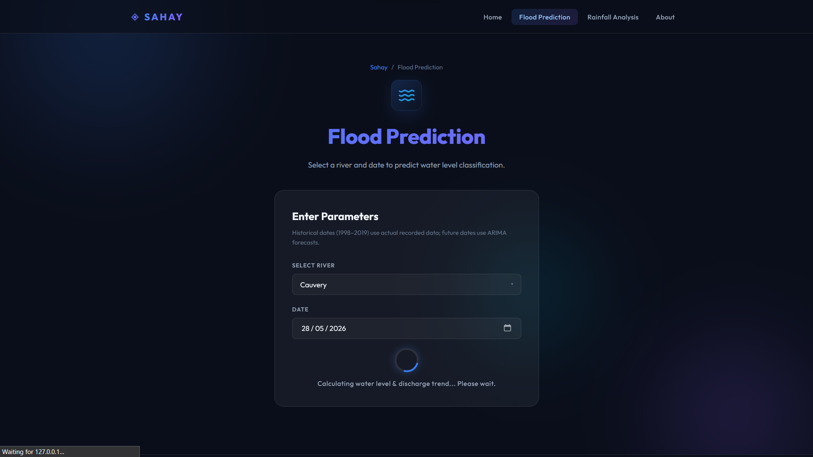
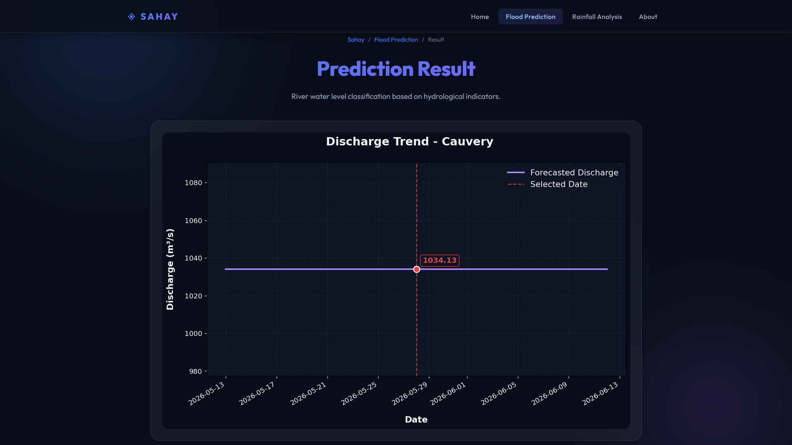
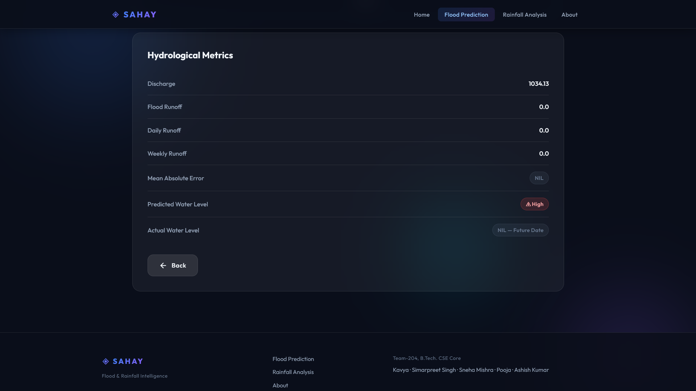
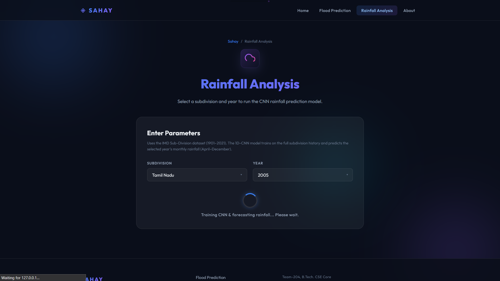
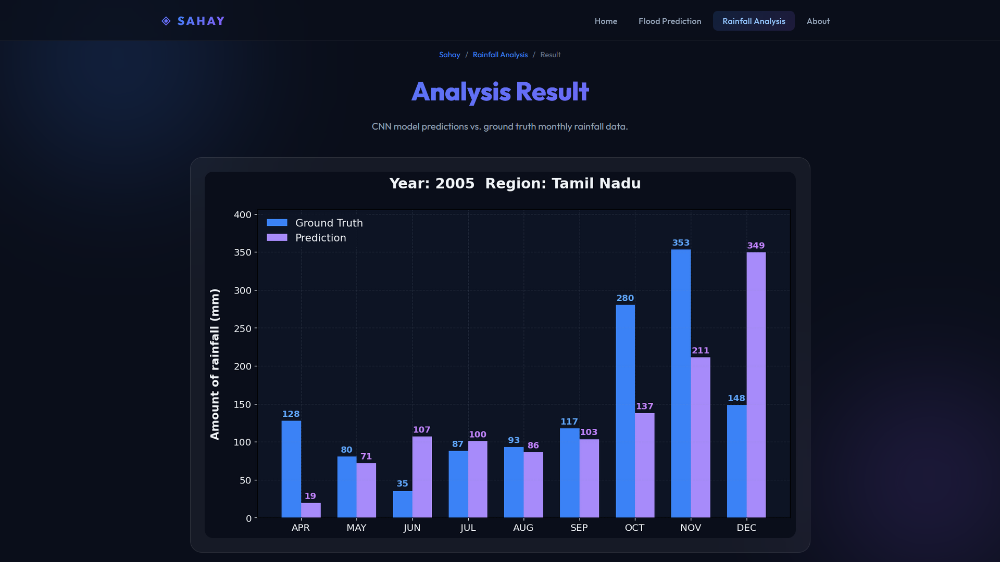
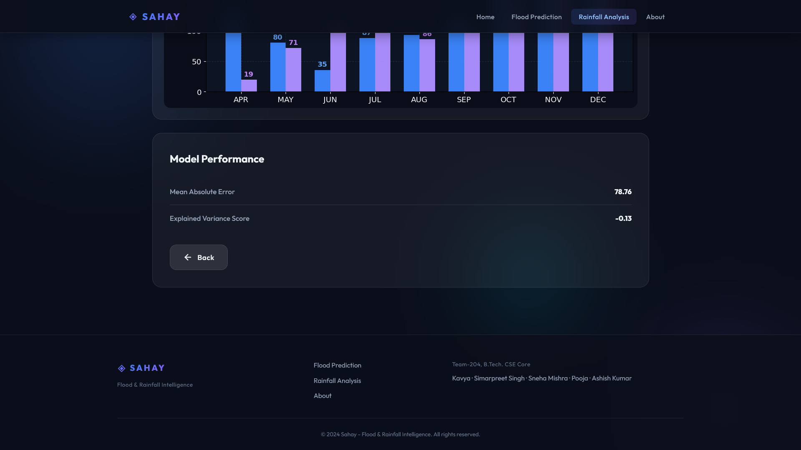
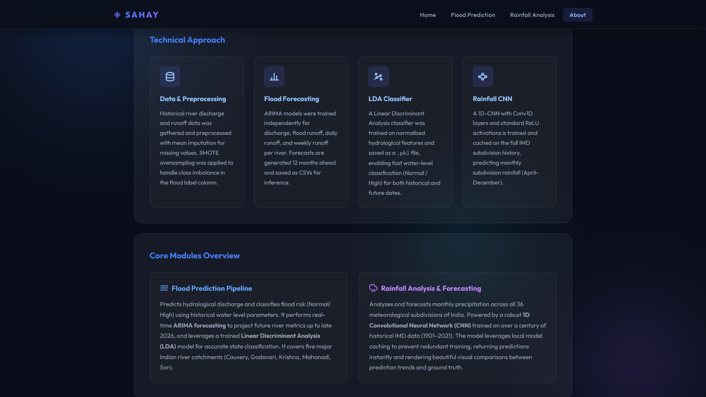
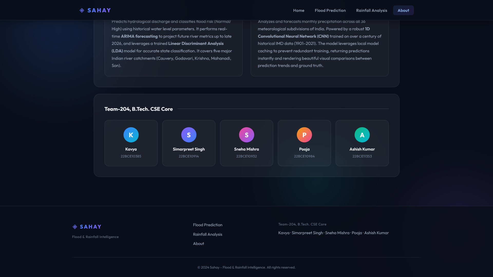

# 📸 Sahay Application Gallery

Below is the complete, high-resolution visual walkthrough of the Sahay v1.0 interface, displaying all 14 chronological screenshots in full width.

---

### 1. Home - Landing Hero

---

### 2. Home - Core Modules Grid

---

### 3. Home - Scrolled Features

---

### 4. Flood - Input Parameter Form

---

### 5. Flood - Active Loader

---

### 6. Flood - Dynamic Trend Chart

---

### 7. Flood - Classification Table & Metrics

---

### 8. Rainfall - Subdivision Select Form

---

### 9. Rainfall - Local Model Loading

---

### 10. Rainfall - 1D-CNN Predictions Bar Chart

---

### 11. Rainfall - Evaluation Scores

---

### 12. About - Technical Approach Cards

---

### 13. About - Core Modules Grid

---

### 14. About - Team Showcase

